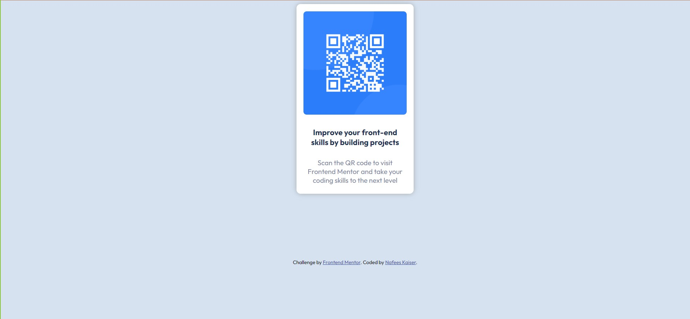

# Frontend Mentor - QR code component solution

This is a solution to the [QR code component challenge on Frontend Mentor](https://www.frontendmentor.io/challenges/qr-code-component-iux_sIO_H). Frontend Mentor challenges help you improve your coding skills by building realistic projects. 

## Table of contents

- [Overview](#overview)
  - [Screenshot](#screenshot)
  - [Links](#links)
- [My process](#my-process)
  - [Built with](#built-with)
  - [What I learned](#what-i-learned)
  - [Continued development](#continued-development)
- [Author](#author)

## Overview

### Screenshot



### Links

- Solution URL: [solution](https://github.com/nafees-kaiser/QR-code-component-main.git)
- Live Site URL: [live site](https://nafees-kaiser.github.io/QR-code-component-main/)

## My process

### Built with

- Semantic HTML5 markup
- CSS custom properties
- Flexbox

### What I learned

I learned about some basic styling such as box shadow, flex box and a little bit of media queries.

```css
/* Flex box */
.parent{
  display: flex;
  flex-direction: column;
  justify-content: center;
  align-items: center;
}
```
```css
/* Box shadow */
.container{
  box-shadow: 1px 1px 7px 0px rgba(142, 140, 140, 0.619);
}
```

### Continued development

I want to continue to learn more about different uses of flex box. Doing this project I realized I have very little idea of how to use media queries. So I will learn a lot about media queries.

## Author

Frontend Mentor - [@nafees-kaiser](https://www.frontendmentor.io/profile/nafees-kaiser)
